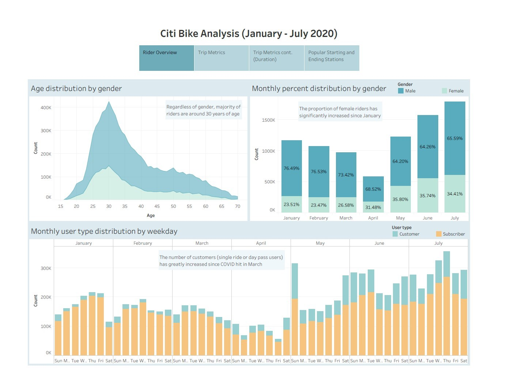

# Tableau Challenge - Citi Bike Analytics

## Data Source
Monthly CSV files (January - July 2020) from [Citi Bike NYC Data webpage](https://www.citibikenyc.com/system-data).

## Visualizations
Visualizations created in Tableau available on [Tableau Public](https://public.tableau.com/profile/alysma#!/vizhome/CITIBIKE_16035920723180/CitiBikeAnalytics).

## Analysis
**Data manipulation**  
Due to Tableau Public’s data row limit of 10 million rows, I limited the scope of Citi Bike data to January 2020 until July 2020 to capture data both before and after COVID. Each month’s data during this period was combined in Alteryx and exported as a single CSV file to be used in Tableau. To account for outliers in the data, the following two filters were applied to the data source in Tableau: (1) users with a birth year later than 1950 (max 70 years old) and (2) trip durations less than 3600 seconds (1 hour). The latter was decided by the fact that few riders would ride for more than the 45 minutes included in the annual membership (30 minutes for single ride and day pass customers) to avoid the additional fees that come with riding past the allotted time.

**Rider overview**  
The makeup of Citi Bike users was analyzed by looking at age, gender, and user type. I filtered the data for visualizations with gender as one of the factors by excluding users classified as “Unknown” under gender. Majority of riders were found to be in their mid-twenties to mid-forties, the peak at 30 years old for both male and female riders. Looking at the monthly percent distribution of riders by gender per month, we can see a significant increase in overall ridership for both males and females since April and a change in proportion of riders by gender over the months: the proportion of male riders decreased from 76.49% in January to 65.59% in July, and thus the proportion of female riders increased from 23.51% in January to 34.41% in July. 

The monthly user type distribution by weekday graph gives us a different perspective on the effect of COVID on Citi Bike usage. Due to the rapid rise in COVID-related cases and subsequent lockdowns, April sees a marked drop in number of trips taken on Citi Bikes. Then in May, once restrictions began to somewhat relax, there was an overall increase in both customer and subscriber riders. This could be associated with concerns regarding the use of public transportation. While it is typically assumed subscribers (those with an annual membership) include more New York residents and customers (single ride or day pass users) consist of more non-residents such as tourists, the rapid increase in customers in particular from May is most likely due to New York residents themselves. Most likely they are using bikes on an as-need basis as a temporary primary form of transportation during this abnormal time. Regardless, the proportion of customers continue to be at its largest on the weekends.

**Trip metrics**  
The total number of trips taken in January, February, and March remain around 1.1 million each, but after the state’s initial response to the COVID pandemic, the trip count increased by leaps each month—1,411,622 in May, 1,793,719 in June, and 2,033,925 in July. July’s numbers are awfully close to doubling that of March. We can also see the effect COVID has had on peak ride times. Peaks from January to March coincide with morning and afternoon rush hour at 8am and 5pm. On the other hand, after COVID hit and most people began to work from home, the peak ride time is seen to shift to a singular spike in the late afternoon/early evening around 5 and 6 pm.

Specifically assessing the length of trips on Citi Bikes, we can see a general rise in average trip duration from January, though the average sees a small decrease from May to July. In fact, the average trip duration almost doubles from 11.483 minutes in January to 19.674 in May. This increase is perhaps due to the change in seasons. With warmer temperatures, more individuals may be riding these bikes as a form of recreation. Taking a deeper look at the percent distribution of rides by trip duration by month, we see increases in rides that go past 15 minutes, from making up only 25.79% of total rides in January to 49.12% in July. May sees more than half of rides spanning greater than 15 minutes at 57.98%. Despite the overall increase we see in longer trips, majority of rides are still between 5 to 10 minutes for all months.

**Popular starting and ending stations**  
We see a complete overlap in top ten stations for both starting and ending stations, although the order itself differs between the two. This overlap is most likely due to stations being concentrated around common tourist landmarks, popular locations, areas near bridges connecting to other parts of New York, and common subway/train stops in Midtown and Lower Manhattan, including West Village, Hudson Yards, Madison Square Garden, Grand Central Terminal, and Central Park. These common destinations are both main hubs for New York residents and tourists alike.

[PDF file of analysis](citibikeanalysis.pdf)
